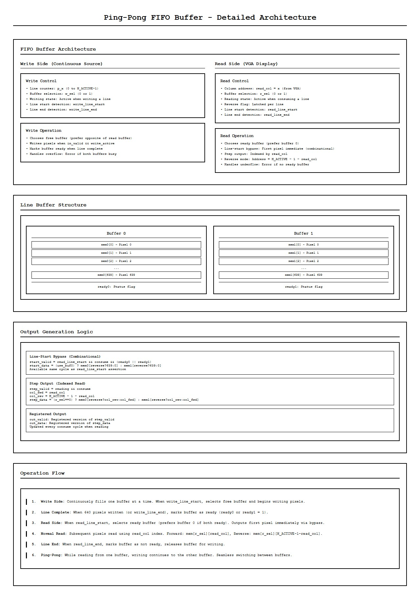
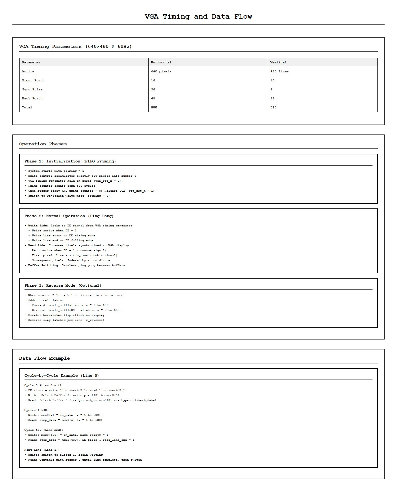

# VGA Image Stream with Ping-Pong FIFO Buffers

Continuous VGA video output from an RGB24 pixel stream using double-buffered line FIFOs. One buffer receives input pixels while the other supplies output to the VGA display.

---

## Architecture


The system accepts an RGB24 stream with ready/valid handshaking, buffers lines in ping-pong FIFOs, and outputs synchronized to VGA timing.



Two line buffers alternate roles each line. While buffer 0 reads out to VGA, buffer 1 fills from the input stream, then they swap.



Standard VGA timing with HSYNC, VSYNC, and data enable signals. The design supports 640×480 @ 60Hz by default.

---

## Structure

```
VGA Image Stream with Ping-Pong FIFO buffers/
├── top_stream.v              # Top module (FIFO + VGA)
├── video_stream_fifo.v       # Ping-pong FIFO
├── vga.v                     # VGA timing generator
├── top_stream_tb.v           # Main testbench
├── video_stream_fifo_tb.v    # FIFO testbench
├── tools/
│   ├── video_to_rgb.py       # Convert video to RGB24
│   └── waves/*.ps1           # Waveform viewing scripts
├── media/
│   ├── input/                # Input videos
│   └── frames/               # Output frames (PPM)
└── frames/
    └── video_frames.rgb      # Raw RGB24 data for testbench
```

---

## Quick Start

Prerequisites:
```
choco install icarus-verilog  # Windows
pip install opencv-python numpy
```

Convert video to RGB24:
```powershell
cd "VGA Image Stream with Ping-Pong FIFO buffers"; python tools/video_to_rgb.py --input media/input/first_video_short.mp4 --output frames/video_frames.rgb --width 640 --height 480 --fps 30
```

Run simulation:
```powershell
cd "VGA Image Stream with Ping-Pong FIFO buffers"; iverilog -g2012 -o stream_tb top_stream_tb.v top_stream.v video_stream_fifo.v vga.v; vvp stream_tb
```

Output: A captured frame saved to `media/frames/stream_normal.ppm`

View it:
```powershell
ffplay media/frames/stream_normal.ppm
```

---

## Features

**Ping-pong buffering:** Two line buffers enable continuous streaming without drops.

**Reverse mode:** Horizontal mirroring for flipped output.

**Status flags:** 
- `underflow` - Read from empty buffer
- `overflow` - Write to full buffer  
- `line_mismatch` - Buffer selection error

**VGA timing:** Proper HSYNC/VSYNC/DE generation for 640×480 @ 60Hz.

---

## Modules

**`top_stream.v`** - Coordinates FIFO and VGA timing.

**`video_stream_fifo.v`** - Dual line buffers with alternating read/write. Supports reverse read order for horizontal flip.

**`vga.v`** - Generates VGA timing signals and pixel coordinates.

---

## Waveforms

View with GTKwave:
```powershell
cd "VGA Image Stream with Ping-Pong FIFO buffers"; powershell -ExecutionPolicy Bypass -File tools\waves\wave_top_stream_tb.ps1
```

Key signals:
- `write_buf_sel`, `read_buf_sel` - Active buffer
- `ready0`, `ready1` - Buffer ready flags
- `in_valid`, `in_ready` - Input handshaking
- `out_valid`, `out_data` - Output to VGA
- `de`, `hsync`, `vsync` - VGA timing
- `x`, `y` - Pixel coordinates

Watch buffer switching at line boundaries and data flow from input through FIFOs to VGA output.

---

## Operation

1. Input stream provides RGB24 pixels with `in_valid`/`in_ready` handshaking
2. FIFO writes to one buffer while reading from the other
3. Buffers swap at line boundaries
4. VGA timing generator controls pixel output timing
5. Output pixels sync with HSYNC/VSYNC/DE signals

Reverse mode reads buffer addresses backward for horizontal flip.

---

## Troubleshooting

**No input file:** Run `video_to_rgb.py` to create `frames/video_frames.rgb`

**Status flags high:** Check timing - underflow means input too slow, overflow means too fast.

**No PPM output:** Verify `media/frames/` directory exists.
